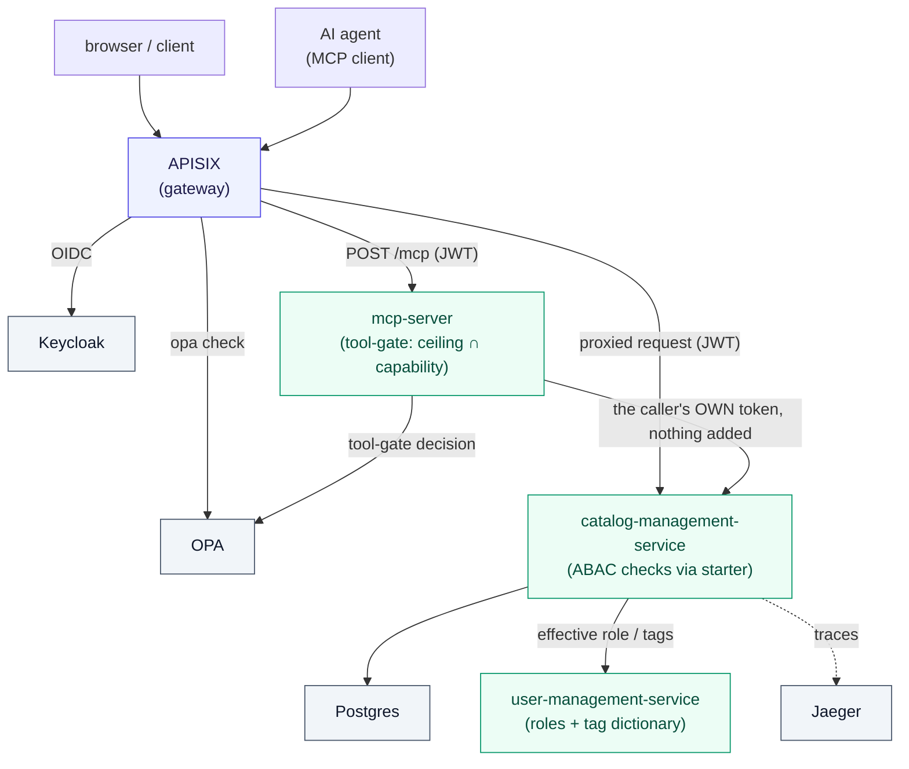

# spring-boot-starter-opa-abac

Production-grade **ABAC authorization for Spring Boot** powered by **Open Policy Agent (OPA)** —
plus a **runnable example** that demonstrates the whole picture end to end.

> Fine-grained, attribute-based access control with hierarchical resources, batch evaluation,
> and partial-evaluation data filtering — the features real applications need and existing
> libraries don't provide.

[](https://github.com/Void3110/spring-boot-starter-opa-abac/actions/workflows/ci.yml)
[](https://opensource.org/licenses/Apache-2.0)

---

> ### 🔍 Two things to look at here
>
> **1. The library** — production-grade ABAC authorization for Spring Boot on OPA, with the features
> real apps need and existing libraries don't: hierarchical resources, batch evaluation, and
> partial-evaluation data filtering. *(The rest of this README.)*
>
> **2. The way it was built** — this repo is also a **worked case study in high-autonomy AI-assisted
> engineering**. Every feature was shipped through the same documented, self-correcting **loop** —
> `plan → decompose → autonomous-implement → review` — where each pass leaves artifacts (in **Mulch**
> and this vault) that make the next one sharper. **27 feature slices, 32 ADRs, 1202 unit/IT tests +
> `opa test` 389/389 + an 18-runner gateway matrix, an ABAC gate measured at +0.79 ms p50, a 0-Critical
> security review** — all delivered this way, with the prompts and per-slice retrospectives kept
> verbatim so the *method* is inspectable, not just the result. → **[How this repo is built](#how-this-repo-is-built-ai-assisted-engineering-the-second-deliverable)** · **[`docs/methodology/`](docs/methodology/README.md)**

## Status

✅ **1.1.0 — published to Maven Central.** Every functional slice is shipped and proven end-to-end
(unit + Testcontainers ITs + `opa test` + a newman gateway matrix + a static-analysis quality gate + a
browser-driven UI QA of the demo SPA), the codebase targets **Spring Boot 4.0 on Java 25**, and the
library is resolvable under `dev.dmitriikonovalov`.

```kotlin
// build.gradle.kts — pull in the whole line via the BOM, then reference modules version-free
implementation(platform("dev.dmitriikonovalov:opa-abac-bom:1.1.0"))
implementation("dev.dmitriikonovalov:opa-abac-spring-boot-starter")
```

Six coordinates publish: `opa-abac-{core, spring-security, spring-data, keycloak-directory,
spring-boot-starter}` + the `opa-abac-bom` platform. The three `example-*` services are demos and are
**not** published.

**Shipped:**

- **Domain-model foundation** — a secured-entity base (UUID id, audit, optimistic-lock `@Version`,
  JSONB resource tags) + a safe locked-write `mutate()` path.
- **Library spine** — a fail-closed OPA client (`HttpOpaClient`, JDK `HttpClient`), JWT→subject
  extraction, and a **role-definition-driven** `@OpaPreAuthorize` enforcement path.
- **Team-based authorization** — an example `user-management-service` resolving a caller's effective role
  from real team membership (role ≠ grant, owner-on-create, the subset/no-self-escalation rule, transfer).
- **Coarse permission categories + safe delegation** — `READ`/`WRITE`/`TAG`/`GRANT`/`CONTROL` categories
  expand to fine actions (deny-overridable), bounded by a five-tier `role_level` ceiling and a senior-tier
  subset rule; a categorized control plane for the `team:*` verbs. See [`docs/guides/PERMISSION-MODEL.md`](docs/guides/PERMISSION-MODEL.md).
- **Dynamic tag dictionary** — runtime-editable tag keys + tag-based grants matched in Rego (`some in` /
  `every`, ANY_OF / ALL_OF); tags are first-class on catalogs, categories, **and** products.
- **Partial-evaluation data filtering** — OPA's Compile API → a JPA `Specification` over JSONB, so a list
  endpoint returns only the rows a subject may see (filtered in SQL, fail-closed to an empty page).
- **N-level hierarchical authorization** — a grant on a Catalog governs a Category/Product nested under it,
  N levels deep (opt-in per relation, deny-overridable, fail-closed; an `ltree` materialized-path resolver
  + atomic re-parent). See [`docs/guides/HIERARCHICAL-AUTHORIZATION.md`](docs/guides/HIERARCHICAL-AUTHORIZATION.md).
- **Hierarchy-aware list filtering** — an inheritable ancestor grant *widens a list* in SQL
  (`scope AND (tagResidual OR subtreeSpec) AND notDenied`), composed so the widening can never escape the
  caller's scope and a leaf deny still overrides it.
- **Attribute-rich pre-authorization** — an opt-in resolver + request-scoped cache decides the gate on a
  resource's *real* attributes and ancestors, with version-guarded mutations (`409` on drift).
- **Multi-tenant isolation + self-service** — team membership is the sole access path to the hierarchy,
  with a real cross-service ownership check so team-create can't squat another user's catalog.
- **Action-affordance metadata** — a response advice attaches an `_actions` map (which actions the caller
  may perform) via one batch OPA round-trip, so a UI renders exactly the buttons the user can use.
- **User directory** — a `UserDirectory` search SPI with an optional Keycloak-admin adapter (least-privilege
  `view-users` client), fail-closed to empty when absent.
- **RFC-7807 error contract + pagination envelope** — every error is `application/problem+json` with a
  typed, library-owned `errorCode` vocabulary (app-extensible), plus `Location` on creates; every list is
  a `{count, page, perPage, items}` envelope with an exact subject-relative count, composed with the
  partial-eval filter — all asserted end-to-end by the newman matrices.
- **Cross-service HTTP resilience** — a backend-agnostic `CallGuard` (Resilience4j) with per-edge
  retry/backoff/circuit-break that makes outages rarer **without** ever re-opening the fail-closed
  outage→deny contract.
- **Agent tool-call authorization** — a third example service puts an **MCP tool surface** in front of the
  catalog and gates it: effective authority is the **principal's ceiling ∩ the agent's declared
  capability**, computed in Rego, over the catalog's *unchanged* policies. **Zero library change.**
  See [Agent tool-call authorization](#agent-tool-call-authorization-mcp).

**Now on Spring Boot 4:** the whole line targets **Boot 4.0 / Framework 7 / Security 7 / Hibernate 7 /
Jackson 3** on **Java 25 / Gradle 9**, as a single artifact line (see [ADR 0026](docs/architecture/adr/0026-spring-boot-4-single-line-port.md)).

**How it got here:** the full pre-publish gauntlet is done — a security review (0 Critical; findings
fixed), a full-history secret scan (clean), a dependency CVE sweep (clean), a load-test re-baseline, a
browser-driven UI QA of the demo SPA (see below), and finally the Maven Central publishing setup — each
delivered as its own reviewed slice. The technical plan lives in
[`docs/to-do/planning/POC-ROADMAP/`](docs/to-do/planning/POC-ROADMAP/POC-ROADMAP.md); the release runbook
is [`RELEASING.md`](RELEASING.md); the full picture (architecture, ADRs, guides) is in
[`docs/`](docs/README.md).

**1.1.0 (2026-07-15):** a **static-analysis quality gate** was adopted (a pinned local SonarQube running
the built-in `Sonar way` rules — the repo's own gate; see [`.sonar-local/`](.sonar-local/README.md)) and
the whole codebase triaged against it: baseline **355 findings → 0** (the mechanical smells fixed, the
by-design false-positives recorded, one supply-chain finding accepted with the Gradle distribution now
SHA-pinned). The one *behavioural* fix is a **fail-closed hardening** in `opa-abac-core`: the OPA client's
policy-path validation used a recursive regex that could throw `StackOverflowError` on a pathological path
— an `Error`, not an `Exception`, so it would have *escaped* the `catch (Exception)` deny handlers and
propagated uncaught instead of denying. It's now a linear, constant-stack scan (grammar-identical, length-
capped, regression-tested). The release passed a deep review (zero findings) and a browser smoke test that
re-confirmed the authorization cut is untouched end to end.

## Adopting the starter (three things you must do)

The starter exposes beans and stays out of your app's security wiring — so a bare dependency does
**nothing on its own** (fail-closed by design: no `SecurityFilterChain` is registered, and every
request is anonymous until you opt in). To actually enforce ABAC, your application must:

1. **Declare a `SecurityFilterChain` and install the `AbacFilter`.** The starter never registers a
   chain (that is the app's call); add the auto-configured `AbacFilter` bean to yours so the subject is
   extracted per request.
2. **Add `@EnableMethodSecurity`** to a `@Configuration` class. `@OpaPreAuthorize` is a method-security
   annotation — **without `@EnableMethodSecurity` every `@OpaPreAuthorize` gate is silently ignored**
   (Spring cannot let a library enable this for you). The starter logs a loud startup **WARNING** if it
   detects the annotations are wired but method security is off, so a misconfiguration can't hide.
3. **Set `opa.abac.subject.trust-forwarded-jwt=true`** — but **only** when the app sits behind a
   signature-validating gateway. The default JWT extractor does not verify signatures itself; until you
   acknowledge the gateway-trust posture it stays disabled (every request anonymous, all checks deny),
   with a startup warning explaining why. Alternatively, provide your own `AbacSubjectExtractor` bean.

See [`docs/guides/ABAC-AUTHORIZATION.md`](docs/guides/ABAC-AUTHORIZATION.md) for the full wiring and the
[example services](example-catalog-management-service/) for a working `SecurityConfig`.

## This is a monorepo

Two things live here, built together so the library and real consumers evolve in lockstep:

```
spring-boot-starter-opa-abac/
├── opa-abac-core/                       # Framework-agnostic ABAC model + OPA client (library)
├── opa-abac-spring-security/            # Spring Security integration (AuthorizationManager, @OpaPreAuthorize)
├── opa-abac-spring-data/                # Partial-eval → JPA Specification filtering + ltree hierarchy
├── opa-abac-spring-boot-starter/        # Auto-configuration (the published starter)
├── example-catalog-management-service/  # E-commerce product catalog REST service (the app we secure)
├── example-user-management-service/     # Users/teams/role-definitions/tag-dictionary (drives the ABAC attributes)
├── example-mcp-server/                  # MCP server: @McpTool catalog proxies behind an OPA tool-gate (agent authz)
├── infra/                               # The local rig: APISIX, Keycloak, OPA (+ policies), Jaeger
├── scripts/postman/                     # Newman e2e matrices (the through-the-gateway proofs)
└── docs/                                # Architecture, ADRs, guides, per-slice planning packages
```

The `opa-abac-*` modules are the publishable library. The three `example-*` services are
demonstrations and are **not** published.

### The architecture (running today via `deploy.sh`)



The `user-management-service` (teams, role definitions, a dynamic tag dictionary) supplies the
attributes the ABAC decisions are made with — and dogfoods the starter to secure its own API.

The `mcp-server` is a **second front door** onto the same resources for AI agents — and the reason it is
drawn reaching OPA *and* the catalog separately: it decides whether the **tool call** is permitted, then
makes the downstream request with the caller's own token and nothing added, so the catalog re-decides the
**resource** on its own unchanged policies. See
[Agent tool-call authorization](#agent-tool-call-authorization-mcp) below.

## The example: catalog-management-service

An e-commerce **Product Catalog Management** service. Simple, but hierarchical — exactly the
shape ABAC needs to show off:

- **Catalog** → **Category** (self-referencing parent/child tree) → **Product**

Built with the **vanilla** `org.openapi.generator` Gradle plugin
(`generatorName = spring`, `interfaceOnly`): the OpenAPI spec generates API interfaces + DTOs,
and we write the `@RestController` implementations. Persistence is Postgres via Spring Data JPA,
schema managed by Liquibase. The service is **secured by default** — every `/api/v1/**` request
requires an authenticated subject and a real OPA decision, so the meaningful way to drive it is
**through the rig** (below). That's deliberate: an authorization showcase whose example runs open
would undercut its own pitch.

### Browse it standalone (no auth, read-only exploration)

```bash
./profile.sh up        # start Postgres (Docker), host port 5433
./gradlew :example-catalog-management-service:bootRun
# Swagger UI (API browsing) at http://localhost:8080/swagger-ui.html
./profile.sh down      # stop & remove
```

Swagger UI, the OpenAPI spec, and `/actuator/health` are open, so you can explore the API surface —
but **API calls will return 401**: there's no token source and no OPA standalone. To exercise the
API, run the full rig.

> Postgres is published on host port **5433** (not 5432) to avoid colliding with other
> local Postgres instances. Override with `SPRING_DATASOURCE_URL` if needed.

### Run the full secured rig (APISIX → OPA → app → Postgres)

To see ABAC enforced end-to-end — gateway OIDC, OPA decisions, the user-service, tracing:

```bash
./profile.sh up                                          # base Postgres
ENABLE_OIDC=1 ENABLE_USER_SERVICE=1 ./deploy.sh up --pods 2
# gateway at http://localhost:9085 ; then run an allow/deny matrix:
cd scripts/postman && ./run-hierarchy-matrix.sh          # or run-tests.sh / run-filter-matrix.sh / ...
ENABLE_OIDC=1 ENABLE_USER_SERVICE=1 ./deploy.sh down
```

> The newman matrices under [`scripts/postman/`](scripts/postman/) are the through-the-gateway proofs
> (role / team / tag / data-filtering / hierarchy). Mint tokens **in-network** (APISIX validates the
> issuer as `keycloak:8888`) — the scripts handle this. See [`infra/README.md`](infra/README.md).

### Running the tests

Integration tests (`CatalogCrudIT`) run the full catalog → category → sub-category → product
CRUD walk-through against a **real Postgres 16** spun up by [Testcontainers](https://testcontainers.org),
with the real Liquibase migrations applied — so they verify the actual deployed schema, not a
substitute database. They need a container runtime.

```bash
./gradlew build          # under Docker Desktop, Testcontainers auto-detects the daemon
```

Using **podman** instead of Docker? The build auto-discovers the podman machine's API socket
(via `podman machine inspect`) and disables the privileged Ryuk reaper, so `./gradlew build`
works with no extra config. To target a specific daemon, set `DOCKER_HOST` and it takes
precedence:

```bash
export DOCKER_HOST="unix://$(podman machine inspect podman-machine-default \
  --format '{{.ConnectionInfo.PodmanSocket.Path}}')"
./gradlew build
```

GitHub Actions provides Docker out of the box, so CI runs these tests with no extra config.

### Static-analysis quality gate

This public repo has no hosted SonarQube, so a **pinned local SonarQube** *is* the static-analysis gate
([`.sonar-local/`](.sonar-local/README.md)) — the built-in `Sonar way` Java rules on a reproducible
analyzer pin, findings-only. It reports on the files changed vs `main`, so a contributor sees a clean
signal before pushing:

```bash
docker compose -f .sonar-local/docker-compose.yml up -d && ./.sonar-local/bootstrap.sh  # once per machine
./.sonar-local/sonar-local.sh          # findings on files changed vs main → expect CLEAN
```

The full tree is at **0 open findings**; standing by-design false-positives are recorded, so a non-clean
result on a change is a real signal, not noise.

## Agent tool-call authorization (MCP)

An AI agent calling tools on someone's behalf collapses **two identities into one bearer token**: the
human the call is for, and the agent making it. Everything else in this repo answers *"may this
**human** act on this resource?"* — so an agent inherits the human's **whole** ceiling. And the tool
surface above it has no gate at all: the MCP specification covers how a server validates a bearer, not
*which* tools that bearer may then call, and offers no way to vary the advertised list per caller.

`example-mcp-server` — **four read-only `@McpTool` catalog proxies** on Spring AI 2.0.0, streamable-HTTP
MCP (spec revision `2025-11-25`) — closes that with a structure rather than a feature:

| Layer | Asks | Owned by | Policy |
|---|---|---|---|
| **Tool-gate** | may this *(principal, actor)* pair invoke **this tool at all**? | the MCP server | `agent_tools.rego` — new, `default allow := false` |
| **Target-gate** | may this **principal** touch **this resource**? | the catalog service | its per-type policies, **unchanged** |

**Nothing travels between them.** A tool body calls the catalog REST API with **the caller's own bearer
and nothing else** — the outbound client sets exactly `Authorization` and `Accept`; no role, capability,
acting-as header or minted token exists anywhere in the module. The catalog service re-derives the
principal exactly as it would for a browser. Effective authority is therefore **principal ceiling ∩
agent capability**, held *across* two independent layers instead of passed between them — and the
intersection is computed **in Rego**, not in Java:

```rego
effective_actions := principal_actions & agent_actions   # a set intersection can only SHRINK
```

That one line is the whole agent model. A capability naming an action the ceiling does not grant
contributes nothing, and a tool surface that asserts nothing downstream **can only fail to narrow,
never widen** — bypass the tool-gate entirely and the worst case is the human's own authority.
(Propagating a role downstream instead would be the very fail-open shape the tenant-isolation slice
deleted.)

**Proven live through the gateway** — `scripts/postman/run-agent-tool-matrix.sh`, **53 requests /
78 assertions, 0 failures**, entering at `/mcp` alongside every other proof here rather than at a
published pod port. The assertions pin the streamable-HTTP framing *and* the authorization cells; every
cell below is a *difference between callers*, never "a 200":

| Caller (same principal unless noted) | `tools/list` advertises | `get_product` on its own catalog |
|---|---|---|
| **human** — no actor claim | all four tools | allowed |
| **`agent-readonly`** — capped below `get_product`'s `medium` risk tier | exactly `list_catalogs`, `get_catalog` | **denied at `tool-gate`** |
| **`agent-overreach`** — capability lists WRITE, GRANT and every verb | the human's four, **never more** | allowed |
| the same **`agent-readonly`**, acting for a **low-privilege** principal | `[]` | denied |

The middle two rows are the argument, and they are drawn on *one* token: the same principal is
permitted `get_product` **directly**, so row 2 is a real restriction rather than a missing grant — and
row 3 is a capability that lists everything and still buys nothing. A *foreign* catalog denies at
**`target-gate` / `ACCESS_DENIED`** instead, so the two layers are distinguishable in the error the
model receives — every denial is a structured `CallToolResult` naming its layer and a stable code, so a
model can react (pick another tool, ask the human to escalate) rather than retry blindly.

Dual identity is additive: RFC 8693 `act` semantics on a plain custom claim minted by a **stock
Keycloak** protocol mapper — no token exchange. An **absent** actor is an ordinary human call; a
**malformed** one denies. `tools/list` is filtered by **one batch round-trip**, but the roster is a
**hint, never a grant**: call-time enforcement is authoritative and unconditional, which is what makes
a mid-session revocation bite. Three drills prove the edges on the rig rather than in prose — killing
the PDP mid-run empties the roster **and** denies every call (zero widening; the pre-kill vector
returns exactly on restart), running with the agent-gate **off** stops the narrowing while the
catalog's own gate still denies, and emptying an actor's profile removes the tool from the roster
**and** denies it at call time.

**Zero library change.** No `opa-abac-*` module, no existing example service and no pre-existing
`.rego` document was touched — verified by diff. The MCP server reaches the starter only through its
public seams, the way an adopter would (an in-repo project dependency on the same unmodified source),
which is what makes the target-gate denial mean anything: it denies at the shipped layer, byte-for-byte.
**The library does not ship agent support — this is an example built *on* it.**

Two limits, stated rather than hidden: the roster filter reaches two pinned SDK internals
**reflectively**, because MCP Java SDK 2.0.0 exposes no per-caller `tools/list` seam
([java-sdk #578](https://github.com/modelcontextprotocol/java-sdk/issues/578)) — it fails startup by
design if an upgrade moves them, and carries a kill-switch; and the per-type catalog policies never see
the actor, so agent-aware *row* filtering is not expressible here. Extracting a reusable
`opa-abac-agent` library module is the slice's stated **exit criterion** and is deliberately **not**
shipped — the seams get exercised by a running demo before anything is frozen into published API.

```bash
ENABLE_MCP=1 ./deploy.sh up --pods 2      # the tool surface, behind the gateway at /mcp
scripts/postman/run-agent-tool-matrix.sh  # the E1–E11 matrix, through the gateway
```

Full contract: [`docs/guides/AGENT-TOOL-AUTHORIZATION.md`](docs/guides/AGENT-TOOL-AUTHORIZATION.md) ·
decision record: [ADR 0028](docs/architecture/adr/0028-agent-tool-call-authorization.md) · review
(14 findings, **0 Critical**): [`docs/code-review/AGENT-TOOL-AUTHZ-REVIEW.md`](docs/code-review/AGENT-TOOL-AUTHZ-REVIEW.md).

## How this repo is built — AI-assisted engineering (the second deliverable)

Beyond the library, this repo is a deliberate, **studyable case study in high-autonomy AI-assisted
engineering**. The headline is not "a workflow" — it's an **engineered loop**: every slice ships through
the same documented cycle, and each pass leaves artifacts that make the *next* pass sharper. Two loops, at
two timescales:

- **Inner loop** (per ticket) — `prime → build → test → ★architecture-review+refactor → e2e → commit`.
  Unit-green is not "done": it's the *trigger* to review-and-refactor **before** the heavier validation.
  Self-correction is built into every ticket.
- **Outer loop** (across slices) — a **run retrospective** is recorded after each slice (was it a clean
  run or did it pause to ask — and what should planning have pre-resolved), and the *next* slice's planning
  reads it. The loop literally learns: an oversized slice paused once → that became a **slice-sizing gate**
  every later slice is checked against.

```
① PLAN          ② DECOMPOSE              ③ AUTONOMOUS IMPLEMENT       ④ REVIEW / SHIP
chat + grill-me  design → ordered tickets  one agent runs the prompt,   /deep-review (multi-lens,
→ ADRs, design   + QA cases + a verbatim   ticket by ticket,            adversarial verify) →
                 autonomous prompt         checkpoint-gated,            PR → CI → merge →
                                           fail-closed                  record the run retrospective ──┐
     ▲                                                                                                 │
     └─────────────── the retrospective + the accumulators feed the NEXT slice's planning ◀────────────┘
```

**What makes it a *loop*, not a pipeline, is two accumulators** — the memory that carries between passes:

- **Mulch** — the *experiential* memory (`ml prime` before a task, `ml record` after a durable insight).
  Its `autonomous-runs` domain is the outer loop's state store.
- **This vault** (`docs/`) — the *decisional* memory: immutable ADRs, living guides, per-slice `STATUS`
  notes, review notes, QA records. Phase ① reads it to know what's decided and what's still unpinned.

Each slice's planning package (`00-DESIGN`, the ordered tickets, the **verbatim**
`AUTONOMOUS-IMPLEMENTATION-PROMPT.md`, and per-ticket `STATUS` notes) is preserved under
[`docs/to-do/`](docs/to-do/) so a reader can see exactly how the work was reasoned about, handed off, and
verified — nothing is hidden behind "the AI did it."

**What the method delivered** (all shipped through this loop):

| | |
|---|---|
| **24** feature slices | each planned → decomposed → autonomously implemented → reviewed |
| **31** ADRs | every structural fork pinned as an immutable decision record |
| **1069** unit/IT tests · `opa test` **276/276** · **15**-runner gateway matrix | the automated proof, real Postgres (Testcontainers) + through-the-gateway |
| **+0.79 ms** ABAC gate at p50 | measured on the real rig, statistically flat at the tail ([PERFORMANCE.md](PERFORMANCE.md)) |
| **0 Critical** security review | pre-publish 8-angle review + secret scan + CVE sweep, findings fixed |

**The tooling that powers each phase** (with upstream credits and the orchestration patterns each one
instantiates):

| Phase | Tooling |
|-------|---------|
| ① Plan | **grill-me** (Matt Pocock — a fork-resolving interview) → immutable ADRs + a design |
| ② Decompose | **decompose** (this repo's skill) → the ordered tickets, QA cases, and the verbatim autonomous prompt |
| ③ Implement | one agent runs the prompt, checkpoint-gated, with an architecture-review gate before every validation |
| ④ Review | **deep-review** — a multi-lens, adversarial workflow (fan-out → **refute** → synthesize); **security-review** for whole-surface passes |
| Across passes | **Mulch** (Jaymin West — the expertise store, primed before / recorded after) + **the vault** (the decisional accumulator) |

The orchestration shapes (fan-out, adversarial-verify, completeness-critic, loop-until-dry) are
**Anthropic's dynamic-workflows / "a harness for every task"** patterns, composed per phase.

**Fail-closed is the load-bearing invariant** every slice is checked against — no error path ever widens
access. And the loop is deliberately **human-gated**: the maintainer runs each phase and decides what
merges (an auditable loop, not a runaway flywheel) — a feature, for a method meant to be trusted.

> **The full method lives in [`docs/methodology/`](docs/methodology/README.md)** — the loop framing, the
> 4-phase lifecycle, the three failure modes it counters, and the portable, vendor-neutral phase
> [`templates/`](docs/methodology/templates/). The deep, canonical reference (the verbatim prompt skeleton
> + the lessons baked into it) is
> [`docs/guides/AUTONOMOUS-IMPLEMENTATION-FLOW.md`](docs/guides/AUTONOMOUS-IMPLEMENTATION-FLOW.md).

## Verified in a real browser — the authorization cut, seen end to end

Automated tests prove the cut at the unit, IT, `opa test`, and gateway layers. As the **last pre-publish
gate**, the whole thing was also driven **through a real browser** against the live rig — an agent piloting
the demo SPA (an in-app Chromium) across **five personas**, so the authorization boundary is observably
real to a human, not just green in CI. Full record + screenshots-of-record:
[`docs/code-review/PRE-PUBLISH-UI-QA-2026-07-12.md`](docs/code-review/PRE-PUBLISH-UI-QA-2026-07-12.md).

Nine case groups (**A–I**), **all PASS** — each verified as a *difference between personas*, never "a 200":

| Group | What was proven live |
|---|---|
| **A** Auth / session | Keycloak PKCE login; identity chip + realm roles; switch-persona clears the session (no silent SSO) |
| **B** Tenant isolation *(the headline)* | member sees the catalog · **outsider's list is empty** (`{count:0}`) · outsider **deep-link → 403** `problem+json` — membership is the sole access path |
| **C** Hierarchy + pagination | drill catalog → category → product; list is a `{count, page, perPage, items}` envelope with a **subject-relative** count |
| **D** Action affordances | the `_actions` map drives the UI — owner sees full controls, viewer read-only, editor write-but-no-management: **buttons mirror enforcement** |
| **E** Predicted-deny UX | **amber** = the client's optimistic prediction, **red** = the server's real verdict — amber is never treated as enforcement |
| **F** Write / tag / dictionary | `201` create · tag-on-create · the runtime tag-dictionary editor on **all three** taggable types · an illegal tag value → `422` |
| **G** Control plane + directory | live user-directory search · the **self-service grant loop closed** (grant → re-login → catalog now visible) · a custom role stays management-incapable |
| **H** Error contract | every denial is RFC-7807 `application/problem+json` with a typed `errorCode` |
| **I** Regression | Boot-4 images: console clean; a client cannot set the operator-only `abac_deny` |

The pass surfaced **one** defect — **DEF-1**, a React-StrictMode double-provisioning race that flashed a
spurious "provisioning failed" banner on first login (dev-mode, cosmetic, **no** security/authorization
impact). It was fixed the same day (a single-flight guard + treating a `409`-on-create as success) and
re-verified live with a fresh user. That's the point of the browser gate: it catches the experience-level
warts the assertion suites structurally can't see.

For **1.1.0** the browser gate ran again as a **delta** pass, focused on the paths the release touched
(the fail-closed OPA-client path-validation rewrite): allow paths round-trip, deny paths deny (outsider's
empty list + a single-GET deep-link `403`), and `_actions` differ per identity on the *same* resource —
**all PASS, zero defects**, confirming the fix is transparent to the observable cut. Record:
[`docs/code-review/PRE-PUBLISH-UI-QA-2026-07-15.md`](docs/code-review/PRE-PUBLISH-UI-QA-2026-07-15.md).

## Requirements

- Java 25+
- Spring Boot 4.0+
- A container runtime — Docker or podman (for the example infrastructure and the integration tests)
- **Open Policy Agent (OPA) 1.x** — the decision engine the library calls; the local rig runs it for you
- **PostgreSQL** — the example uses Postgres-specific features (JSONB tags, `ltree` materialized paths)

## Performance

What does the authorization layer cost? Measured on the real rig by the committed k6 harness
([`scripts/load/`](scripts/load/)): on the post-SB4-port stack the full ABAC gate (subject
extraction → role resolve → OPA decision) adds **≈ +0.8 ms at p50** over an identical-gateway
baseline and is statistically flat at the tail — sub-millisecond per request. Plus the partial-eval
list ceiling, the attributed per-request cross-service call counts, and fail-closed behavior under
dependency outages — see **[PERFORMANCE.md](PERFORMANCE.md)** (numbers, methodology, findings, and
the one-command rerun).

## Documentation

The full architecture, decision records, and per-feature guides live in [`docs/`](docs/README.md):
- **Guides** — [`docs/guides/`](docs/guides/) (ABAC spine, team/tag/data-filtering/hierarchical authz, e2e)
- **Agent / MCP authorization** — [`docs/guides/AGENT-TOOL-AUTHORIZATION.md`](docs/guides/AGENT-TOOL-AUTHORIZATION.md) + [ADR 0028](docs/architecture/adr/0028-agent-tool-call-authorization.md) — the two-layer model, the tri-state capability seam, the roster-is-a-hint rule, and the fail-closed table
- **Architecture & ADRs** — [`docs/architecture/`](docs/architecture/)
- **Roadmap** — [`docs/to-do/planning/POC-ROADMAP/`](docs/to-do/planning/POC-ROADMAP/POC-ROADMAP.md)
- **AI-assisted methodology** — [`docs/methodology/`](docs/methodology/README.md) (the `plan → implement → review` loop this repo is built with, framed + indexed) + the deep reference [`docs/guides/AUTONOMOUS-IMPLEMENTATION-FLOW.md`](docs/guides/AUTONOMOUS-IMPLEMENTATION-FLOW.md) and the portable phase [`templates/`](docs/methodology/templates/)
- **Policy tooling** — [**rego-skill**](https://github.com/Void3110/rego-skill): the companion Claude Code skill for generating, reviewing, and testing the OPA Rego policies this starter evaluates — the 6-step secure-policy workflow plus a multi-agent security-audit for a whole policy corpus. The example policies in this repo are maintained with it.

## License

[Apache License 2.0](LICENSE)
