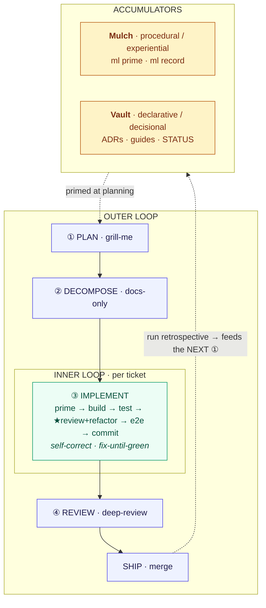

---
tags:
  - status/active
  - type/guide
  - area/methodology
---

# AI Engineering Methodology — an engineered loop

How this repo is built with AI agents. The headline is **not** "a workflow" or "a pipeline" — it is a
deliberately **engineered loop** whose defining property is that *every pass leaves artifacts that make the
next pass better*. The unit of engineering is the loop, not the prompt.

> **This repo is the reference implementation.** The method here was developed and hardened on this
> project (a public, clean-room ABAC/OPA Spring Boot library) across ~20 slices, then generalized into a
> corp IDP context elsewhere. What follows is the honest, worked version — including where the loop is
> human-gated and where it is not.

> **Canonical + deep dive.** This note is the *front door*. The full, verbatim method — the invariant
> prompt skeleton, the per-slice slot table, and the lessons baked into each — lives in
> [`../guides/AUTONOMOUS-IMPLEMENTATION-FLOW.md`](../guides/AUTONOMOUS-IMPLEMENTATION-FLOW.md) (the source
> of truth the skills defer to; when a template and that guide disagree, **the guide wins**). The portable
> phase templates live in [`templates/`](templates/).

---

## 1. The loop (the frame everything else hangs on)

Two loops, at two timescales. The inner loop makes **one slice** correct; the outer loop makes **the next
slice easier** than the last. The two **accumulators** are what turn a pipeline into a loop — without them,
every task starts cold and nothing compounds.

> *Outer loop = across slices (weeks). Inner loop = per ticket (minutes–hours). The two accumulators are
> the loop's memory — read at ①, written at ③④.*



- **Inner loop** (per ticket, §4): `prime → build → test → ★review+refactor → e2e → commit`. The **★ gate
  is self-correction**: unit-green is not "done" — it is the *trigger* to review-and-refactor **before** the
  heavier validation runs. `fix-until-green` with a bounded **≥3-attempts** blocked-exit closes the loop
  without spinning. The agent critiques and improves its own output *within* the pass.
- **Outer loop** (across slices, §7): the **run retrospective** feeds the *output of executing* back into
  the *input of planning the next slice*. The clearest instance: an oversized slice (B4) paused mid-run →
  the retrospective recorded *why* → that became the **slice-sizing gate** (`AUTONOMOUS-IMPLEMENTATION-FLOW`
  §2a) that every later slice is checked against. The loop fired once and hardened the method.
- **The two accumulators** are what make it *compound*:
  - **Mulch** — the *procedural / experiential* memory: `ml prime <domain>` before a task, `ml record`
    after a durable insight, `ml sync`. The **`autonomous-runs`** domain is literally the outer-loop state:
    one record per slice run capturing "clean full-success vs paused-and-asked, and what planning should
    have pre-resolved." Primed at phase ① of the *next* slice.
  - **The Obsidian vault** (`docs/`) — the *declarative / decisional* memory: **immutable ADRs**
    (superseded, never edited), living **guides**, per-slice **STATUS notes**, **review notes**, **QA
    records**. It is the loop's state store; phase ① reads it to know what is already decided and what is
    still unpinned.

**Honest boundary — where the loop is *not* autonomous.** The outer loop is **human-gated**: the maintainer
runs `/decompose`, kicks off the run, does phase ④, and decides what merges. This is *a loop with a human
closing it each turn*, not a self-improving flywheel that ships to production unattended. That is a
deliberate design choice, not a limitation — an auditable loop where each iteration is inspectable is the
point. A more-autonomous "software factory" variant (self-triggering, merge-gated execution) is a tracked
future direction, not what this method claims today.

---

## 2. One iteration — the four phases

The lifecycle is **one turn of the loop**. Planning + decomposition front-load the thinking into immutable
artifacts and an unambiguous work list; the autonomous prompt turns that into a self-contained,
checkpoint-gated, fail-closed hand-off one agent executes end to end.

```
① PLANNING (interactive, with the maintainer)
   chat → optional /grill-me to resolve every fork
   end-results: ADR note(s) · USER-STORIES · 00-DESIGN     (docs-only — NOT the implementation)
        │ forks resolved, decisions pinned
        ▼
② DECOMPOSITION (interactive, docs-only)
   design + ADRs + stories → the work list
   end-results: <SLICE> index · 01-DECOMPOSITION (T1…TN) · 10-QA-TEST-CASES
                · AUTONOMOUS-IMPLEMENTATION-PROMPT · STATUS stubs
        │ maintainer reviews the package
        ▼
③ AUTONOMOUS IMPLEMENT (one agent, the prompt)
   branch feature/void3110/<slice>; per-ticket loop T1…TN, IN ORDER, STOP at each checkpoint:
     prime → build → test → ★review+refactor → integration/e2e → docs → Mulch → one commit → CHECKPOINT
        │ maintainer reads checkpoints
        ▼
④ REVIEW / SHIP (maintainer-driven)
   per-slice:      /deep-review the branch · push · PR · CI green · merge
   whole-surface:  /security-review (pre-release, or after a risky slice) — fan-out, live-probed, report-only
   record the run retrospective → Mulch · move planning/ → implemented/   ── closes the OUTER loop
```

**Division of labour (a hard line carried in every prompt):** in ①② the maintainer and the planning agent
work *together* and produce only docs. In ③ the agent does **everything local on the branch** — code, tests,
docs, Mulch, one commit per ticket. The **maintainer pushes, opens the PR, and merges** (④). The prompt must
say *"Do NOT push, open PRs, or touch `main`."* Pushing is a separate, explicit turn — the human-gate on the
loop.

**Two review cadences, not one.** `deep-review` gates *each slice's diff* on the way to merge (④, every
slice). `security-review` is the **whole-surface** pass on a *release / risky-slice* cadence — because
privilege escalation and cross-tenant leaks live in the *interaction* between slices that each passed
`deep-review` clean in isolation. It is **report-only**: fixes land as a normal follow-up slice.

---

## 3. Planning (① — chat + grill-me → decisions)

**Goal:** reach *shared understanding* and pin every fork **before** any ticket exists — so the autonomous
run almost never has to stop and ask. Conversational and docs-only. When the design tree has real branches,
run **`grill-me`** (it interviews one question at a time, walking each branch, recommending an answer).
Explore the codebase to settle anything the code can answer rather than asking.

| Deliverable | What it pins |
|---|---|
| **ADR(s)** (`../architecture/adr/NNNN-*.md`) | Each **structural** fork — a schema/authority shape, a module/service boundary, *where a check is evaluated* (app vs Rego), additive-vs-breaking, a deliberate "we did **not** do X." Lightly-MADR. **Immutable once Accepted; superseded, never edited.** |
| **USER-STORIES** (`../to-do/planning/USER-STORIES.md`) | The **product lens** — "as a «persona» I can/can't …", each story tagged to the phase that delivers it. |
| **`00-DESIGN.md`** (the slice's folder) | The **how-it-works** prose: mechanism, **fail-closed posture**, **considered-&-rejected**. Links the ADR(s) for *why*. Living; the ADRs are not. |

**Exit criterion:** every fork that would otherwise make the agent stop and ask is decided and recorded (an
ADR if structural, `00-DESIGN`'s considered-&-rejected otherwise), and the phase-tagged user stories exist.
Prime `autonomous-runs` here and explicitly ask: *which fail-open/contract semantics are unpinned, and which
rig gotchas from prior runs apply?* — that is the outer loop feeding this phase.

---

## 4. Decomposition (② — design → tickets)

**Goal:** turn the settled design + ADRs + stories into an **unambiguous, ordered work list** and the
**self-contained prompt** that drives it. The **`decompose`** skill automates this
([`templates/DECOMPOSE-SKILL-TEMPLATE.md`](templates/DECOMPOSE-SKILL-TEMPLATE.md)). The package is a 1:1
structural mirror of every prior slice: the `<SLICE>` index, `01-DECOMPOSITION` (T1…TN, each with **Goal /
Deliverables / Acceptance / What-NOT-to-touch** + the critical path), `10-QA-TEST-CASES`, the verbatim
`AUTONOMOUS-IMPLEMENTATION-PROMPT`, and STATUS stubs.

**The slice-sizing gate (run BEFORE decomposing — an outer-loop lesson made mechanical).** A slice whose
blast-radius can't be *fully enumerated during planning* produces regressions that surface in the e2e
instead of being pinned in the design. Split if any smell holds: **(a)** it both removes/changes a shared
mechanism *and* adds surface depending on it; **(b)** it crosses >1 deployable; **(c)** ticket count > ~5–6;
**(d)** planning can't name every consumer of a mechanism it changes. This gate *is* the B4 retrospective,
codified.

**What makes a good ticket:** one focused commit; named deliverables; acceptance = the exact test/e2e that
proves the *cut* (not just a 200-vs-403 shape); What-NOT-to-touch carrying the slice invariants forward; and
**every new seam names its consumer + a non-happy-path test** (a seam with zero callers is not done).

---

## 5. Autonomous implementation (③ — the inner loop, one agent)

One agent runs the prepared prompt, ticket by ticket, checkpoint-gated, fail-closed. The **per-ticket loop**
(T1→TN, in order, STOP at each checkpoint):

1. **Prime** for the files you're about to touch (`ml prime --files <path>`); re-read the ticket's section.
2. **Build the deliverables** exactly as listed — match the surrounding naming and idioms. Clean-room.
3. **Write/extend the tests** (the ticket's U*/I*/E* cases). Real dependencies (Testcontainers Postgres,
   never H2; an in-process `HttpServer` stub for the OPA client, not WireMock); `opa test` for policy.
4. **Compile + run unit tests until green.** Fix-until-green.
5. **★ ARCHITECTURE REVIEW + REFACTOR — the gate BEFORE integration/e2e.** Unit-green → review → refactor →
   re-test. Lenses: **fail-closed**, **security** (name the widening that would matter and why it can't
   happen), **concurrency/idempotency** (decide *under* the same guard that holds through the commit),
   **wiring** (every seam has a consumer + a non-happy-path test), **boundary/additivity**
   (`opa-abac-core` stays Spring-free; additive to the public API), **module separation**, **pattern-reuse**,
   **SOLID**. Write what it found into the STATUS note — if nothing substantive, say so; **do not invent
   churn.**
6. **Integration / e2e** (mandatory for the relevant tickets). Fix-until-green.
7. **Update documentation** — tick the ticket in the index; record real values in the STATUS note; the
   ticket that owns a guide topic finalizes it.
8. **Mulch** — record any genuine reusable insight, then `ml sync` (**`git restore --staged .` first** — the
   sync commit must touch `.mulch/` only, the swept-staged trap).
9. **Commit** — one focused commit on the branch (code + tests + docs + STATUS together), identity
   `Void3110 <void31102025@gmail.com>`.
10. **CHECKPOINT — STOP and report.** Summary · test results · **the review findings + refactoring applied**
    · docs updated. Then the next ticket. **Do not batch tickets.**

**Stop-and-ask vs decide-and-record:** a new fork the docs don't cover *that changes externally-visible
behavior* is a stop-and-ask; an internal detail with a sane default is decide-and-record-in-STATUS. Full
runner discipline (resume across sessions, escalation, sub-agents-for-scouting-only):
[`templates/AUTONOMOUS-IMPLEMENT-SKILL-TEMPLATE.md`](templates/AUTONOMOUS-IMPLEMENT-SKILL-TEMPLATE.md).

---

## 6. The three failure modes (the design brief — why the ceremony exists)

Long autonomous runs degrade into three named failure modes (the Anthropic harness thesis). Every
structural element of this method counters one — and each counter is a *loop closing*:

| Failure mode | How it shows up | The counter (a loop) |
|---|---|---|
| **Goal drift** — constraints erode as context summaries lose fidelity | a load-bearing invariant (fail-closed, additive-only, a forbidden dependency) quietly weakens across tickets | **Mulch** re-primes the invariant from the store each ticket + the **per-ticket checkpoint** + the prompt's **hard rules** restated every slice |
| **Agentic laziness** — declares success on partial work | acceptance only *shape*-asserted (200-vs-403), not the actual *cut*; N-of-M done | the **headline pair** (a real Testcontainers IT + an e2e that asserts the cut) + deep-review's autonomous-run lens |
| **Self-preferential bias** — over-grades its own output | a STATUS "review found nothing" where the diff says otherwise; ritual refactor notes | **deep-review's adversarial verification** — *separate* skeptic agents refute each finding before it survives |

The accumulators are the deepest counter to goal drift: an invariant written to Mulch/an ADR *survives the
context window*, so the loop's memory outlives any single run's summarization.

---

## 7. The outer loop — the run retrospective (why the next slice is easier)

At the end of a slice run (phase ④, after `/deep-review`, before the folder moves to `implemented/`), record
**one `autonomous-runs` retrospective**: outcome (full-success / paused-and-asked / blocked) + the *class* of
fork that stopped it + any checkpoint friction + **the planning-gap → fix** (what phase ①/② should have
pre-resolved so it won't recur). Across the first six slices the single recurring pause class was *"design
left a fail-open/contract semantic unpinned,"* followed by *"a rig/test-harness gotcha discovered mid-run."*
Pre-resolving those in design is what converts a paused run into a full-success run — so phase ① of the next
slice **primes `autonomous-runs` and asks about exactly those**. That read-at-①, write-at-④ cycle is the
outer loop; the slice-sizing gate (§4) is its most valuable single output.

---

## 8. The tooling & skills stack (what powers each phase)

| Tool | Phase | Role in the loop |
|---|---|---|
| **grill-me** (Matt Pocock) | ① Plan | one-question-at-a-time fork resolution → the ADRs + design |
| **decompose** (this repo's skill; [template](templates/DECOMPOSE-SKILL-TEMPLATE.md)) | ② Decompose | deterministic template instantiation — keeps the prompt skeleton verbatim (counters goal drift at the planning seam) |
| **the autonomous prompt** ([template](templates/AUTONOMOUS-IMPLEMENT-SKILL-TEMPLATE.md)) | ③ Implement | the self-contained, checkpoint-gated hand-off one agent runs |
| **deep-review** (this repo's skill; [template](templates/DEEP-REVIEW-TEMPLATE.md)) | ④ Review | fan-out → **adversarial verification** → completeness-critic (per-slice diff gate) |
| **security-review** ([template](templates/SECURITY-REVIEW-SKILL-TEMPLATE.md)) | ④ Review (release) | whole-surface fan-out, adversarially verified + **live-probed** against the running rig; report-only |
| **Mulch** (Jaymin West) | ①/③/④ | the experiential accumulator — `ml prime` before, `ml record` after; the outer loop's memory |
| **the Obsidian vault** (`docs/`) | all | the decisional accumulator — ADRs, guides, STATUS, review notes, QA records |

The workflow patterns (fan-out, adversarial-verify, completeness-critic, loop-until-dry) are **Anthropic's
dynamic-workflows / "a harness for every task"** shapes, composed per phase.

---

## Related

- [`../guides/AUTONOMOUS-IMPLEMENTATION-FLOW.md`](../guides/AUTONOMOUS-IMPLEMENTATION-FLOW.md) — the deep,
  canonical method (this note's source of truth).
- [`templates/`](templates/) — the portable, vendor-neutral phase templates.
- [`../code-review/CODE-REVIEW-WORKFLOW.md`](../code-review/CODE-REVIEW-WORKFLOW.md) +
  [`CODE-REVIEW-CHECKLIST.md`](../code-review/CODE-REVIEW-CHECKLIST.md) — the review process the ④ gate runs.
- [`../architecture/adr/0021-load-testing-methodology.md`](../architecture/adr/0021-load-testing-methodology.md)
  — the load-testing method (a phase-④ pre-release gate).
- [[POC-ROADMAP]] — the slices this method has shipped.
